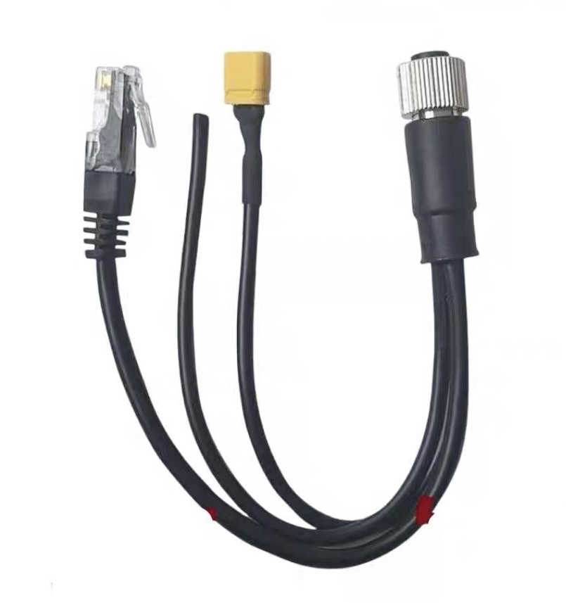
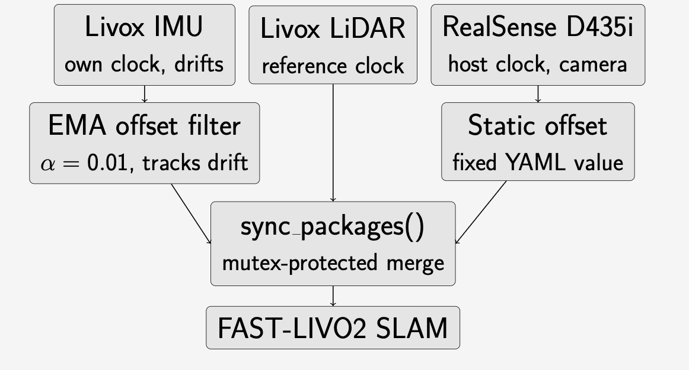
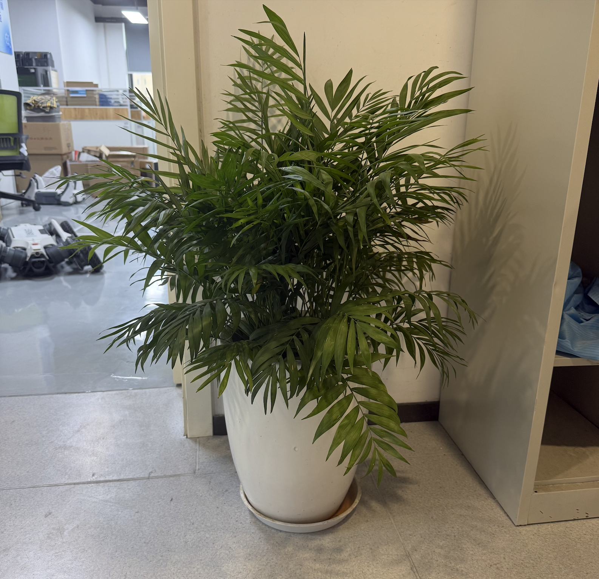

# Hardware extension for Lite3 Robot. Reproduce FAST-LIVO2 as an example.
[](https://discord.gg/gdM9mQutC8)
## 0. Overview
This repo documents the process of installing and reproducing FAST-LIVO2 on DEEP Robotics Lite3 robot, including camera/lidar installation, onboard compute extension and how to test this in an outdoor environment. Original [repo](https://github.com/hku-mars/FAST-LIVO2) and [paper](https://arxiv.org/abs/2408.14035). And you can watch our tutorial videos on Bilibili or Youtube.

**System Environment:** Ubuntu 22.04, ROS2 Humble, Lite3 Venture (ONLY THIS VERSION!), AGX Jetson Orin (or other onboard compute)

## 1. Hardware setup
### 1.1 Onboard compute setup and ROS2 installation

Please setup your onboard compute and install ROS2 on it. For details, please check their websites. We've tested the repo on [AGX Jetson Orin](https://developer.nvidia.com/embedded/learn/get-started-jetson-agx-orin-devkit) with [ROS2 Humble](https://docs.ros.org/en/humble/index.html). Note: we are using Jetpack 6.1 and the cmake version is 3.22.


### 1.2 Intergration with Lite3 robot

If you have Lite3 pro/lidar, you don't need further hardware extension cause there is already a Orin NX and you can use that as additional onboard compute. If you have Lite3 venture, you can follow the installation process in our video. For the 3d printed structure parts, you can download them from [here](https://drive.google.com/drive/folders/1KmWNuOF0Qg5XM6EQKRiWrkJJhoBknjIZ?usp=drive_link). 

## 2. FAST-LIVO2 Installation and Reproduction

### 2.1 Install Livox_ros_driver2 and Livox-SDK2
#### 2.1.1 Lidar connection

This repo supports two Livox lidar variants:

- **Mid-360** (original): use the `MID360` launch files and `MID360_config.json`.
- **Mid-360s** (new variant): use the `MID360s` launch files and `MID360s_config.json`. Both the Livox-SDK2 and `livox_ros_driver2` in this repo have been extended to support the Mid-360s protocol (new command handler, host net info schema, and dedicated config samples under `src/Livox-SDK2/samples/*/mid360s_config.json`).

Connect your lidar following the official user manual for your variant: [Mid-360 user manual](https://terra-1-g.djicdn.com/851d20f7b9f64838a34cd02351370894/Livox/Livox_Mid-360_User_Manual_EN.pdf) or [Mid-360s user manual](https://terra-1-g.djicdn.com/65c028cd298f4669a7f0e40e50ba1131/Mid-360S/UM/Livox_Mid-360s_User_Manual_en.pdf). You will need a cable like this:



Plug the xt30 end to the 24V xt30 of lite3 and plug the ethernet end to a normal x86 ubuntu system. If you open Livoxviewer2 and see that lidar is connected, this step is successful. 

#### 2.1.2 Compiling and installing
First, git clone this repo: 
```
git clone https://github.com/DeepRoboticsLab/fast-livo2-deep-robotics.git
cd fast-livo2-deep-robotics
```

Compile Livox-SDK2 separately:

```bash
cd fast-livo2-deep-robotics/src/Livox-SDK2
mkdir build && cd build
cmake .. && make -j
sudo make install
```


### 2.2 Install librealsense and realsense-ros

#### 2.2.1 Install librealsense

Please follow this [doc](https://github.com/realsenseai/librealsense/blob/master/doc/libuvc_installation.md) to install intel realsense on your AGX Jetson Orin. It's tested to work in the widest range of cases.

Known issues:
```
06/11 17:00:12,985 ERROR [281473429722208] (context.cpp:40) No valid configuration file found at : /home/fjwjetson/.realsense-config.json loading defaults
06/11 17:00:13,098 ERROR [281473429722208] (rs.cpp:256) [rs2_create_device( info_list:0xaaab00eb1d90, index:0 ) UNKNOWN] bad optional access
06/11 17:00:13,098 ERROR [281473429722208] (rs.cpp:256) [rs2_delete_device( device:nullptr ) UNKNOWN] null pointer passed for argument "device"
Could not create device - bad optional access . Check SDK logs for details
No device detected. Is it plugged in?
```

This indicates that the kernel layer has recognized the camera, but the librealsense RSUSB driver lacks permission to access the device node. In simple terms, the permission rules are not being applied correctly. You can try the following command first:

```bash
sudo rs-enumerate-devices
```

If the above command outputs normally, then the root cause is identified: a library version conflict, meaning there are two sets of librealsense in the system:
| Path               | Version         | Source          | Status                     |
|--------------------|-----------------|-----------------|----------------------------|
| /usr/local/lib     | librealsense2.so.2.56.5 | Self-compiled (supports RSUSB) | ✅ |
| /opt/ros/humble/lib| librealsense2.so.2.56.4 | Automatically installed by ROS2 (older version) | ❌ |

When launching without sudo, the older library is loaded, preventing the device from being opened.

### Library Version Conflict Resolution Method

Force the system to prioritize `/usr/local/lib`:

```bash
echo "/usr/local/lib" | sudo tee /etc/ld.so.conf.d/99-realsense-local.conf
sudo ldconfig
```

Then permanently set the environment variable to take effect automatically in all terminals:

```bash
echo 'export LD_LIBRARY_PATH=/usr/local/lib:$LD_LIBRARY_PATH' >> ~/.bashrc
source ~/.bashrc
```

Verify using the following command:

```bash
ldd $(which rs-enumerate-devices) | grep realsense
```

Successful result:

```
librealsense2.so.2.56 => /usr/local/lib/librealsense2.so.2.56.5
```

After this, the launch command should be able to start the depth camera normally.

#### 2.2.2 Install realsense-ros

Please follow this [doc](https://github.com/realsenseai/realsense-ros) to install realsense-ros. For example: 
`sudo apt -y install ros-humble-realsense2-*`.

If you can run this `ros2 launch realsense2_camera rs_pointcloud_launch.py` and see reasonable visualization, this step is successful. 


### 2.3 Build FAST-LIVO2

Install required ROS2 packages:

```bash
sudo apt update
sudo apt -y install ros-humble-pcl-ros ros-humble-compressed-image-transport ros-humble-sophus 
```

Build FAST-LIVO2:

```bash
cd fast-livo2-deep-robotics/src/livox_ros_driver2/
source /opt/ros/humble/setup.bash
./build.sh humble
```

If successful, you should see output indicating completion.

Verify packages:

```bash
cd fast-livo2-deep-robotics
source install/setup.bash
ros2 pkg list | grep livo
```

Expected output should include `fast_livo` and `livox_ros_driver2`.

Change the ip in the matching config file to use the ip from step 2.1.1. Fill the host with the actual host ip and the lidar ip with the actual lidar ip.

- **If you are using Mid-360**, edit `src/livox_ros_driver2/config/MID360_config.json` and run:
  ```bash
  ros2 launch livox_ros_driver2 rviz_MID360_launch.py
  ```
- **If you are using Mid-360s**, edit `src/livox_ros_driver2/config/MID360s_config.json` and run:
  ```bash
  ros2 launch livox_ros_driver2 rviz_MID360s_launch.py
  ```

If you can see lidar points in RViz, this step is successful.


## 3. Run FAST-LIVO2 through ROS2 bag

You can download the ROS2 dataset from the original FAST-LIVO2 (Retail_Street.bag) [here](https://drive.google.com/drive/folders/15RL0__M6ZcCCf0qx8_IM40qhhoPoYnNf?usp=drive_link).

> **Note:** The original dataset was recorded using the older `livox_ros_driver`. Since we are using the newer `livox_ros_driver2`, you must update the topic type inside the dataset database before playing it. Otherwise, the lidar data will be ignored.

**Step 1: Install the sqlite3 tool**
Open your terminal and install `sqlite3` to modify the bag file:
```bash
sudo apt update && sudo apt install sqlite3
```
**Step 2: Update the topic type in the dataset**
Go to the directory where you downloaded the dataset (e.g., `data`), and run the following command to modify the database:
```bash
sqlite3 Retail_Street.db3 "UPDATE topics SET type = 'livox_ros_driver2/msg/CustomMsg' WHERE name = '/livox/lidar';"
```

Run the algorithm:

```bash
cd fast-livo2-deep-robotics
source install/setup.bash
ros2 launch fast_livo mapping_avia.launch.py use_rviz:=True
```

Go to the place where you download the dataset and open a new terminal:

```bash
source install/setup.bash
ros2 bag play Retail_Street.db3  # Use space bar to control play/pause
```

This should launch the mapping process with RViz visualization.
## 4. Run FAST-LIVO2 on real Lite3 robot

The following deployment was verified with a Livox Mid-360s at
`192.168.1.201`, an Intel RealSense D435i, and an AGX Jetson Orin running ROS
2 Humble. Substitute the addresses and camera calibration for your own
hardware where necessary.

> **Important:** The checked-in `avia.yaml` and `camera_pinhole.yaml` retain
> the original ROS2 bag/simulation defaults used in Section 3. Before a real
> deployment, change the camera topic, image dimensions, and intrinsics as
> described in Section 4.2, then rebuild the installed configuration. Revert
> those fields to the checked-in defaults before running the example bag again.

### 4.1 Configure the LiDAR network

The Ethernet adapter connected to the LiDAR must have a static IPv4 address on
the same subnet. A link shown as `UP` is not sufficient if the interface has no
IPv4 address. In this example, the host uses `192.168.1.45/24` and the LiDAR
uses `192.168.1.201`.

Find the Ethernet interface and NetworkManager connection:

```bash
ip -br address
nmcli -t -f DEVICE,TYPE,STATE,CONNECTION device status
```

Configure the connection (replace the connection name and addresses as needed):

```bash
sudo nmcli connection modify "Wired connection 2" \
  ipv4.method manual \
  ipv4.addresses 192.168.1.45/24 \
  ipv4.gateway "" \
  ipv4.dns "" \
  ipv4.never-default yes
sudo nmcli connection down "Wired connection 2"
sudo nmcli connection up "Wired connection 2"
```

`ipv4.never-default yes` prevents the LiDAR-only connection from replacing the
Wi-Fi/default Internet route. Verify that packets to the LiDAR use Ethernet:

```bash
ip route get 192.168.1.201
ping -c 3 192.168.1.201
```

The route should contain `dev eth0 src 192.168.1.45` (with your actual
interface name). Configure the same addresses in the matching driver file:

- Mid-360: `src/livox_ros_driver2/config/MID360_config.json`
- Mid-360s: `src/livox_ros_driver2/config/MID360s_config.json`

For the verified Mid-360s setup, the important fields are:

```json
"host_ip": "192.168.1.45"
```

```json
"ip": "192.168.1.201"
```

If the driver reports `bind failed`, the configured `host_ip` is not assigned
to a local interface, or another driver instance is already using the UDP
ports.

### 4.2 Configure the RealSense color stream

FAST-LIVO2 requires the incoming image size to exactly match the camera model.
The verified D435i configuration uses its RGB stream at `640x480x30` and
publishes it on:

```text
/camera/camera/color/image_raw
```

Set `common.img_topic` in `src/FAST-LIVO2/config/avia.yaml`:

```yaml
common:
  img_topic: "/camera/camera/color/image_raw"
  lid_topic: "/livox/lidar"
  imu_topic: "/livox/imu"
```

The checked-in simulation value is `/left_camera/image`; it must be replaced
with the live RealSense topic shown above for real deployment. The LiDAR and
IMU topics are the same in both cases.

Set the matching resolution and calibrated intrinsics in
`src/FAST-LIVO2/config/camera_pinhole.yaml`. The values below were read from
the D435i used for this deployment and must not be assumed to apply to every
camera:

```yaml
camera:
  model: Pinhole
  width: 640
  height: 480
  scale: 1.0
  fx: 604.3154296875
  fy: 603.8231811523438
  cx: 325.12115478515625
  cy: 261.0074462890625
  d0: 0.0
  d1: 0.0
  d2: 0.0
  d3: 0.0
```

Read the calibration reported by another camera with:

```bash
ros2 topic echo --once /camera/camera/color/camera_info
```

Use the `width`, `height`, and the `K` matrix entries (`fx=K[0]`,
`fy=K[4]`, `cx=K[2]`, and `cy=K[5]`). The RealSense launch argument is
`rgb_camera.color_profile`; using another parameter name or omitting it allows
the driver to fall back to `1280x720x30`, which does not match the configuration
above.

After making these real-deployment changes, rebuild and source the workspace:

```bash
cd fast-livo2-deep-robotics
source /opt/ros/humble/setup.bash
colcon build --packages-select fast_livo --symlink-install
source install/setup.bash
```

Confirm that the installed configuration contains the live topic and camera
size, rather than the simulation defaults:

```bash
ros2 pkg prefix fast_livo
grep -E "img_topic|width:|height:" \
  install/fast_livo/share/fast_livo/config/{avia.yaml,camera_pinhole.yaml}
```

### 4.3 Start the sensors and mapping

Stop old driver instances before starting. Do not switch or restart a sensor
driver while FAST-LIVO2 is running because the resulting timestamp jump can
reset IMU initialization. Start the three processes in order.

Terminal 1 — LiDAR (Mid-360s):

```bash
cd fast-livo2-deep-robotics
source /opt/ros/humble/setup.bash
source install/setup.bash
ros2 launch livox_ros_driver2 msg_MID360s_launch.py
```

For a Mid-360, use `msg_MID360_launch.py` instead. The variant must match the
physical device; a Mid-360s launched with the Mid-360 configuration may create
the ROS node without publishing LiDAR or IMU messages.

Terminal 2 — D435i RGB camera:

```bash
cd fast-livo2-deep-robotics
source /opt/ros/humble/setup.bash
source install/setup.bash
ros2 launch realsense2_camera rs_launch.py \
  enable_rgbd:=false \
  enable_sync:=false \
  align_depth.enable:=false \
  enable_color:=true \
  enable_depth:=false \
  rgb_camera.color_profile:=640x480x30
```

Confirm that the camera startup output says `Width: 640, Height: 480, FPS: 30`.

Terminal 3 — FAST-LIVO2 and RViz:

```bash
cd fast-livo2-deep-robotics
source /opt/ros/humble/setup.bash
source install/setup.bash
ros2 launch fast_livo mapping_avia.launch.py use_rviz:=True
```

Keep the complete sensor assembly stationary for several seconds during IMU
initialization. Once initialization completes, move the robot gradually to
build the map.

### 4.4 Verify the live pipeline

Check the message types:

```bash
ros2 topic type /livox/lidar
ros2 topic type /livox/imu
ros2 topic type /camera/camera/color/image_raw
```

Expected results:

```text
livox_ros_driver2/msg/CustomMsg
sensor_msgs/msg/Imu
sensor_msgs/msg/Image
```

Check that data, rather than only topic names, is present:

```bash
ros2 topic hz /livox/lidar
ros2 topic hz /livox/imu
ros2 topic hz /camera/camera/color/image_raw
```

The verified setup produces approximately 10 Hz LiDAR, 200 Hz LiDAR IMU, and
30 Hz RGB images. Use `Ctrl+C` after measuring each topic. Then confirm that
FAST-LIVO2 is publishing results:

```bash
ros2 topic hz /cloud_registered
ros2 topic hz /aft_mapped_to_init
ros2 topic hz /path
```

If RViz is empty, check the following before changing visualization settings:

1. `ros2 node list` contains `/livox_lidar_publisher`, `/camera/camera`, and
   `/laserMapping`.
2. `ros2 topic info -v /livox/lidar` shows one publisher and the
   `/laserMapping` subscriber.
3. The camera is actually publishing the resolution specified in
   `camera_pinhole.yaml`.
4. The correct `msg_MID360s_launch.py` or `msg_MID360_launch.py` is running.
5. No second/old Livox driver is holding the UDP ports.
6. The sensor remained stationary long enough for IMU initialization.

## 5. Multi-Sensor Soft Time Synchronization
 
The Livox Mid-360s LiDAR and IMU run on separate hardware clocks with no shared reference. Without correction, the timestamp lag between them grows by roughly one second per second, causing FAST-LIVO2 to stall within ~20 seconds of runtime. Hardware synchronization (PTP, GPIO) was not viable here: PTP reaches the Livox unit but not its internal IMU oscillator, and the RealSense D435i's RGB and depth sensors sit on separate PCBs, so GPIO sync cannot reach the RGB stream this pipeline depends on.
 
Software correction in `src/fast_livo/src/LIVMapper.cpp`:
 
- **IMU-LiDAR offset & Gating:** an Exponential Moving Average filter (`α = 0.01`) continuously re-estimates the clock offset from live timestamp comparisons in `imu_cbk`. To prevent artificial delay on pre-synced datasets (e.g., *Retail_Street*), a **one-time startup gate** checks if the initial hardware clock lag exceeds a threshold of **`> 0.1s`**. If the system is already synchronized, the EMA filter remains disabled; if a true hardware desynk is detected, the filter activates and stale queues are safely flushed to avoid loopback errors.
- **Camera offset:** the RealSense stream is corrected independently via a fixed `img_time_offset`, since its driver already timestamps frames against the host clock rather than drifting the way the Livox IMU does. This value is set in the launch/config YAML rather than computed at runtime.
- **Non-blocking timestamp handling:** packet-drop traps that previously discarded IMU/image frames on a detected timestamp jump were replaced with logged warnings, so the pipeline no longer stalls on transient jitter.
- **Thread safety:** all shared buffers (`mtx_buffer`, `mtx_buffer_imu_prop`) are now guarded with `std::lock_guard` for RAII-safe locking across callbacks, and reusable point cloud containers were made `static` to reduce per-frame heap allocation.
 
**Sensor clock sync pipeline:**
 


**Demonstration — plant reconstruction (baseline vs. improved):**
 
|Real-life reference photo| Baseline (unsynchronized) | Improved (EMA sync) |
|---|---|---|
| |  |  |
 
*Without sync, the reconstruction halts early and leaves the flowerpot base and surrounding floor incomplete. With the EMA-based correction active, the flowerpot and surrounding area are captured near-completely.*
 
**Known limitation:** this is a software approximation, not a true hardware sync. Sharp turns can still cause visible camera-LiDAR frame misalignment and accumulated drift in very large environments can eventually exceed what the filter can correct for. For applications needing tighter synchronization, hardware sync via the Livox M12 PPS pin and replacing the D435i with the D415.
 
**Full results and test breakdown:** see the [project poster](images/poster.pdf)

## License

This project is licensed under the GNU General Public License v2.0 (GPL-2.0).

This project incorporates or derives from the following open-source projects:

- [FAST-LIVO2](https://github.com/hku-mars/FAST-LIVO2) (GPL-2.0)
- [livox_ros_driver2](https://github.com/Livox-SDK/livox_ros_driver2) (MIT License)
- [Livox-SDK2](https://github.com/Livox-SDK/Livox-SDK2) (MIT License)

See the LICENSE file for details.
